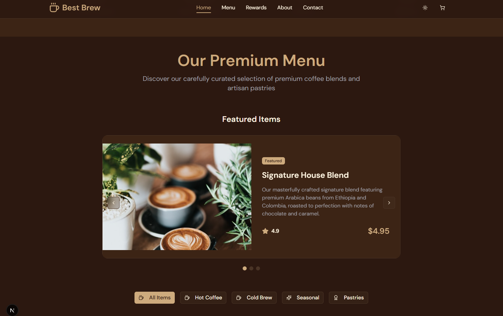

# ☕ Best Brew – Premium Coffee Shop Experience  

Welcome to **Best Brew**, a luxury coffee shop web experience that redefines how customers interact with a café online. Designed with **elegance, interactivity, and performance at its core**, this platform delivers a seamless, mobile-first ordering journey that rivals and surpasses industry leaders like Starbucks.  

  

  

  

  

---

## ✨ Key Features  

### 🎨 Luxury Design Experience  
- Warm **coffee-inspired palette** (mocha browns, crème whites, golden highlights)  
- Premium **typography hierarchy** with modern script + clean sans-serif pairing  
- Smooth **micro-interactions** (hover effects, button animations, parallax sections)  
- Mobile-first responsive layout with pixel-perfect performance on all devices  
- Elegant **scroll animations** with fade-in and parallax depth  

---

### ☕ Interactive Menu System  
- **6 Signature Coffee Drinks**: House Blend, Cappuccino, Vanilla Latte, Americano, Cold Brew, Iced Caramel Latte  
- **6 Artisan Food Items**: Butter Croissant, Blueberry Muffin, Chocolate Scone, Avocado Toast, Everything Bagel, Almond Danish  
- Smart **customization engine**:  
  - Drinks → size selection (S, M, L), milk options (Whole, Almond, Oat, Soy), premium add-ons (Extra Shot, Vanilla Syrup, Caramel Drizzle)  
  - Food → simplified ordering without drink-specific extras  
- **Dynamic pricing** with real-time updates  
- High-quality, **professional food photography** for every menu item  

---

### 🛒 Smart Shopping Cart  
- Elegant **sliding sidebar cart** with smooth transitions  
- Clear breakdown of customizations and options  
- Quantity adjustments with **automatic price recalculation**  
- Running total displayed at all times  
- Persistent cart state during browsing (session-based)  

---

### 🏆 Realistic Rewards Program  
- Fully gamified **Best Brew Club** loyalty system with four tiers:  
  - 🥉 **Bronze** (0–99 points): 5% discount  
  - 🥈 **Silver** (100–299): 10% + free birthday drink  
  - 🥇 **Gold** (300–599): 15% + perks + priority ordering  
  - 💎 **Platinum** (600+): 20% + exclusive menu access  
- Visual tier progression with animated **progress bars**  
- Interactive **tier cards** with hover/shine effects  

---

### 👥 Company Story & Team  
- Compelling **founder’s story** & timeline of Best Brew  
- **Professional team profiles** with hover animations  
- Engaging **testimonial carousel** with customer portraits  
- Authentic **storytelling sections** to build brand trust  

---

### 📱 Contact & Engagement  
- Smooth **animated contact form** with validation  
- Store locator with **map integration**  
- Clear **business hours and contact details**  
- **Newsletter modal** signup with welcome perks  
- **Social media integration** for brand connection  

---

### 🎯 Advanced User Experience  
- ⚡ **Performance optimized** with hardware-accelerated animations  
- ♿ **Accessibility built-in**: ARIA labels, keyboard navigation, screen reader support  
- 🌙 **Auto dark/light theme detection** for user preference  
- 🎁 **Easter eggs**: fun hidden animations (tap logo multiple times!)  
- 🔥 **3D hover & typing animations** for extra polish  

---

## 🌟 Why Best Brew Stands Out  

This isn’t just a coffee shop website — it’s a **luxury digital brand experience**:  

- **Attention to Detail**: Every pixel, animation, and interaction crafted for immersion  
- **Mobile Excellence**: Seamless performance on mobile devices first  
- **Real-World Functionality**: Live cart, loyalty points, and pricing engine  
- **High-End Design**: Premium branding and storytelling for upscale positioning  
- **Customer Delight**: Every interaction designed to *delight, engage, and convert*  

---

## 🎭 Demo Highlights  

1. **Browse** the cinematic homepage with elegant scrolling animations  
2. **Explore** the interactive coffee & food menu with professional photography  
3. **Customize** drinks with smart, intuitive options  
4. **Add to Cart** and watch detailed breakdowns update in real-time  
5. **Track Rewards** and visualize progress toward next tier perks  
6. **Learn Our Story** with engaging team bios and testimonials  
7. **Connect** via contact form, map, or newsletter subscription  

---

  

  

---

💡 *Best Brew is the future of digital café experiences — where luxury design meets practical functionality, and every sip begins with an unforgettable online journey.*  
